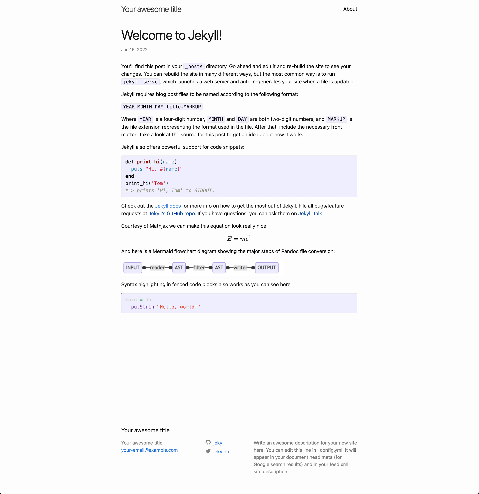

# jekyll-pandoc-markdown-quickstart

## About

A quickstart project to build a Jekyll website with Pandoc as our Markdown parser.

Includes preconfigured support for Mermaid and Mathjax via the Pandoc filters

## Getting started

Install the filters:

* [mermaid-filter](https://github.com/raghur/mermaid-filter) and 
* [mathjax-pandoc-filter](https://github.com/lierdakil/mathjax-pandoc-filter) 

Clone this repo

```bash
git clone git@github.com:fkurz/jekyll-pandoc-markdown-quickstart.git
```

then change directory to the root of the project, install dependencies, and run the local development server.

```bash
cd jekyll-pandoc-markdown-quickstart
bundle install
bundle exec jekyll serve --livereload
```

Click on the blog post titled _Welcome to Jekyll!_ to see an example of a blog post with Mermaid diagram, Mathjax equation and syntax highlighting.

